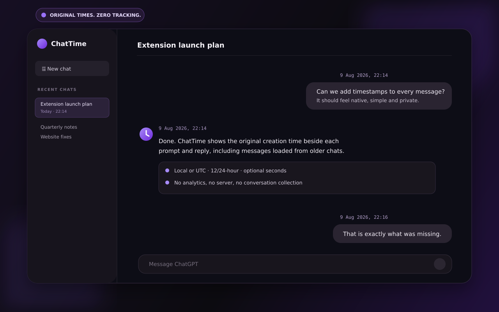

# ChatTime for ChatGPT

ChatTime adds the original date and time to messages on `chatgpt.com`. It is a small, private Manifest V3 extension for Brave, Chrome, Edge, and other Chromium browsers.



## What it does

- Shows the original creation time on user messages and ChatGPT replies.
- Supports 12-hour or 24-hour clocks, local time or UTC, dates, and seconds.
- Can show timestamps above or below every message, user messages only, or replies only.
- Handles streamed replies, long conversations, SPA navigation, light/dark themes, and right-to-left text.
- Uses ChatGPT's message time already loaded in the page instead of inventing a page-load time.

## Privacy by design

ChatTime has no server, analytics, advertising, account, network requests, or remote code. It does not collect, retain, sell, or transmit conversations. The only extension permission is `storage`, used to sync the user's display preferences through the browser.

See [PRIVACY.md](PRIVACY.md) for the complete policy.

## Install locally

1. Download or clone this repository.
2. Open `brave://extensions` or `chrome://extensions`.
3. Enable **Developer mode**.
4. Choose **Load unpacked** and select the `extension` folder.
5. Open or refresh [ChatGPT](https://chatgpt.com/).

## Development

Requires Node.js 20 or newer.

```bash
npm install
npm run check
```

The verified Chrome Web Store package is created at `dist/ChatTime-for-ChatGPT-v1.0.0.zip` with `manifest.json` at the ZIP root.

## Compatibility

| Browser | Support |
| --- | --- |
| Brave | Yes |
| Google Chrome | Yes |
| Microsoft Edge | Yes |
| Other Chromium browsers | Expected |
| Firefox | Not included in v1.0.0 |

ChatTime is an independent, unofficial extension and is not affiliated with or endorsed by OpenAI. ChatGPT is a trademark of OpenAI.

## License

[MIT](LICENSE)
